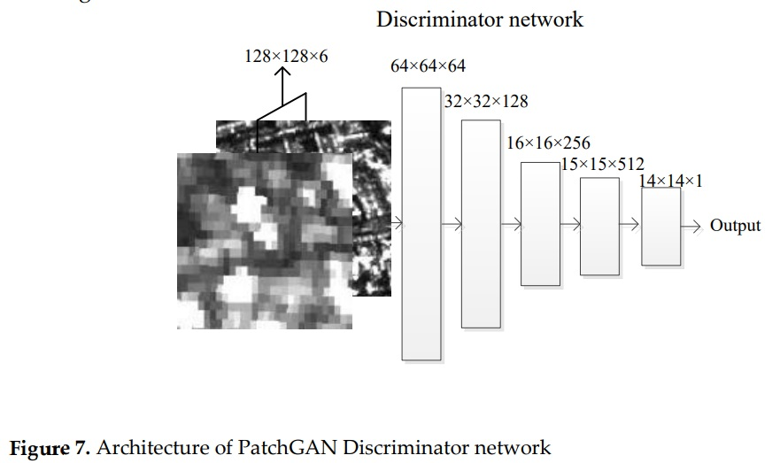
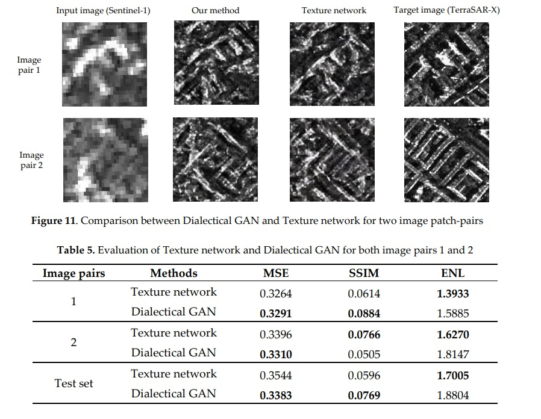
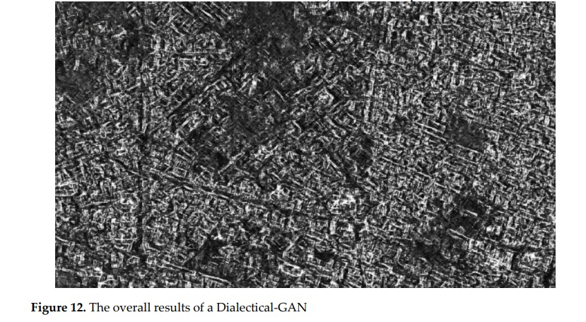

# Dialectical GAN for SAR Image translation: From Sentinel-1 to TerraSAR-X
---
## Abstract
- `SAR` `Synthetic Aperture Rader`이미지는 사람의 시각 시스템에 익숙하지 않은 스펙트럼에 있다.
- 고품질의 `SAR` 이미지에 대한 수요는 상당히 증가하였다.
- 하지만, 고품질의 `SAR`는 높은 비용이 수반된다.
- 이 논문은 고품질 `SAR`이미지를 생성하기 위한 `Dialectical Generative Adversaial Network`를 제안한다.
- 논리학의 `Dialectical` `변증법` 구조를 네트워크에 적용시키고자 하였다.
- 지상 표현 범위가 큰 저해상도 `SAR` 이미지를 고해상도 `SAR`이미지`TerraSAR-X`로 변환한다.
- `Dialectical law`에 따라 `conditional WGAN-GP Loss function` 과 `Spatial Gram matrix`를 결합한 새로운 모델을 제안한다.

## Introduction
- `SAR`시스템의 설계 및 구현은 복잡한 시스템 엔지니어링이며, 많은 자원, 비용 그리고 지적 노력이 필요하다.
  - 이러한 비용 때문에 위성에 있는 대부분의 `SAR` 시스템은 정부 기관에서 지원한다.
- `Image Translation`은 고품질의 `SAR`이미지를 쉽게 얻을 수 있는 방법
  - 문장을 번역할 때 서로 다른 어휘, 문법을 가지고 있지만 같은 뜻을 의미한다는 것을 전제로 한다.
- 딥러닝 기반 `Image Translation`중 처음은 `Gatys el at.`의 논문이다.
  - 이미지의 `Content`와 `Style`을 정의하기 위해 `VGG` 네트워크를 도입
- 두번째는 `Goodfellow et al.`이 만든 `GAN`이다.
  - `Image Translation`은 `pix2pix`로 간주할 수 있다.
  - `Image Translation`을 수행하기 위해 `Isola`는 `Conditional GAN`을 도입하였다.
- 하지만 딥러닝을 이용해 서로 다른 `SAR`기기 간 `Translation`은 거의 주목을 받지 못하였다.
- 1) `TerraSAR-X`의 고해상도는 혁신적 응용을 가능하게 한다.
- 2) `Sentinel-1`의 영상의 넓은 `coverage`는 여러 장 수집하는 필요성을 줄이고, 고비용 데이터에 대한 수요를 줄인다.
- 3) `Sentinel-1` 영상은 자유롭게 수집할 수 있지만, `TerraSAR-X`의 이미지는 상업적이기 때문에 접근하기 어렵다.
- 이러한 조건을 만족하기 위해 `GAN`프레임 워크의 `변증법`적 구조와 계층적 `SAR` 정보 분석에 근간한 `DialecticalGAN`을 제안한다.
- validation에 사용되는 데이터는 도시 지역을 cover하기 때문에 지리학적 `arrangement` 정보를 추출하기 위해 `Spatial Matrix`를 사용한다.
- `GAN`을 사용함으로써 좋은 결과를 얻을 수 있었고, 기존의 방법보다 더 나았음을 밝힌다.

## Dataset
- 이 논문에선 같은 목적을 가지지만, 특성이 다른 두가지 일반적 위성 시스템인 `Sentinel-1`과 `TerraSAR-X`를 사용한다.
- `Sentinel-1`
  - `ESA`에서 출시한 `C-Band`위성 시스템
  - 해상 및 육상 모니터링
  - 환경 재난 비상 대응 및 상용
- `TerraSAR-X`
  - 독일 항공 우주 센터와 에어버스 사이의 민-관 파트너십 하에 운영
  - `X-band`위성 시스템
  - 뛰어난 기가학 구조 및 고해상도
- `Sentinel-1`은 대규모 `SAR`이미지를 생성하는 좋은 옵션
- `TerraSAR-X`는 고해상도 목적

#### Image Quantization
- `SAR`이미지의 진폭은 우리가 일반적으로 사용하는 `0 ~ 255`의 범위에 있지 않다.
  - 이 범위는 `RCS`? 와 연관있으며 범위가 넓다.
- `8 bit quantization`이 다른 밝기 범위에서 적용된다.
- `Sentinel-1`의 범위는 `0 ~ 800`
- `TerraSAR-X`의 범위는 `0 ~ 570`

#### Image co-registration
- 서로 다른 두 센서 간의 `Image translation`은 `co-registration`된 쌍으로 수행되어야 한다.
- 두 이미지는 같은 좌표에서 찍힌 이미지여야 한다.
- `Geo-coding`을 사용하여 두 이미지가 동일한 `content`, 동일한 `Pixel size`를 갖도록 한다.
- `QGIS`를 이용해 `Interpolation` 및 `co-registration`을 완료한다.

#### Training Data and Test Dataset
- `SAR` 이미지 분류에 적합판 패치 크리고 `128 X 128`의 패치 크기를 선택하였다.
- 각 패치는 50%로 `overlap`되었다.
- Training: 1860 패치 Test: 224 패치

## Related Work
- 딥러닝을 이용한 `Image Translation`
  - 2016년에는 `CNN`을 이용해 예술적인 이미지를 만듬
    - `Pre-trained VGG`를 이용해 `Style Transfer`
  - `Neural Style Transfer`의 속도를 가속하기 위해 많은 후속 연구가 발생됨
  - 일반적으로 `Texture Network`
    - `GAN`의 출현으로 몇몇 연구자들은 텍스쳐의 정의 없이 더 일반적인 방법을 찾고자 튜닝? 함
- 이 논문에서는 세가지의 일반적 방법을 제시한다.
  - `Gatys`의 방법 : `Image style transfer using convolutional neural networks`
  - `Texture Network` : `Texture Networks: Feed-forward Synthesis of Textures and Stylized Images`
  - `Conditional GAN` : `Image-to-image translation with conditional adversarial networks`

#### Image style transfer using convolutional neural networks
- `VGG-19`를 `Image translation`에 응용
- 기존은 `ImageNet` 에서 높은 성능을 낼 수 있었다.
- 먼저 `Pre-trained` 네트워크에 `SAR`이미지를 넣고 `Feature map`을 추출한다.
  - `SAR`데이터는 [0~255]로 `rescale`되었다.
- 5개의 레이어에서 `Feature map`추출

- layer의 처음 부분 `ReLU1_1`, `ReLU1_2`, `ReLU1_3`의 이미지들은 `Sentinel-1`과 `TerraSAR-X`사이에 꽤 큰 차이가 있다.
- 반면, `ReLU_4`, `ReLU_5`는 두 개의 센서에서 온 이미지가 비슷하다.
- 높은 레이어는 더 높은 의미 정보를 담고 있다.
- 그러나 `ReLU_5`는 거의 특징이 없다. 다른 논문에서는 `ReLU_5`가 시각적 이미지에 대한 `real content`를 담고 있다고 하지만, 여기서는 사용하지 않는다.

#### Texture definition-Gram Matrix
- `Gram matrix`의 도입으로 `Gatys`의 논문은 성공할 수 있었다.
- `Gram matrix`는 각 `feature map`간의 상관관계를 보여주는 `metric`이다.

l번째 레이어의 `Gram matrix`는 위 식을 따라 계산할 수 있다.
$F_(i:)^l$ : $l$레이어의 $i$번째 `feature map` 으로 부터 생성된 열 백터
$M_l$ : l번째 레이어의 피쳐 맵 사이즈? (이해가 잘안됨)
- `Gram matrix`의 각 요소는 아래 식과 같이 계산된다.

$<.>$: 내적

$l$번째 레이어의 `Gram matrix`를 얻을 때 ${G^l}_{l{\in}L_{selected}}$에서 $L_{selected}$는 텍스쳐 정보를 정의하기 위해 선택된 레이어 셋이다.
- 위에서 정의한 `Gram matrix`를 이용해 두 장의 이미지의 `Style difference`를 계산할 수 있다 .
$L_{style}={\Sigma}_{l{\in}L_{selected}}w_l{\parallel}{\hat{G^l}- G^l}{\parallel}_F^2$

$W_l$ : 하이퍼 파라미터의 일종, $l^{th}$에서의 스타일 가중치
${\hat{G^l}}$: $l$번째 레이어에서 생성되는 이미지의 `Gram matrix`
${G^l}$ : `reference image`의 `Gram matrix`
${{\parallel}.{\parallel}}_F$ : `Frobenious norm`

- 이 논문의 경우에선 스타일 이미지가 더이상 예술적인 그림이 아니다.
- 그리고 `Gram matrix`는 잘 수행되지 않는다.

- `feature map`의 벡터화는 `Gram matrix`에서 지도(사진)안의 `arrangement information`을 완전히 가리게된다.
- 도시 지역에 유용한 `Arrangement information`을 유지하기 위해서 더 잘 맞는 `metric`이 필요하다.
- 도시 지역의 물체는 대게 직사각형이기 때문에 도시지역 `SAR`이미지의 주요 아웃라인은 직선이 되어야 한다.

**Spatial Gram Matrix에 대한 이해는 현재까지 조금 부족한 상황입니다. 이해가 제대로 되는 대로 수정해서 올리겠습니다.**

- **`Spatial Gram method`** 는 이러한 배치(배열, `arrangement`)구조를 표현하는 좋은 방법으로 제시되었다.
- 자기 유사성 매트릭스(`self-similarity matrix`)와 생성된 매트릭스의 `Spatial transformation`에 의해 정의됨 (?)
- `feature map`을 수평, 수직으로 다른 레벨로 `tiling`한 `Spatial transform`을 적용해 직선 텍스쳐를 나타낸다.

${\Delta}l = {\{2^1, 2^2\, ..., 2^{7-l}\}}$

7은 패치 크기인 128로부터 결정된다. ${\because}2^7$

$G_{row,{\delta}}^l$,$G_{col,{\delta}}^l$은 각각 행, 열과 관련된 `Spatial transform`의 타입이다. $\delta$는 이동량을 나타낸다.

- `feature map`을 $\bold{F}^l$이라고 할 때, 그것의 변형은 $T{({\bold{F}^l})}$로 표기한다.
- $T$는 `Spatial transform`의 함수를 의미한다.

**<중략>**

- 따라서 Style의 loss는 다음과 같이 정의된다.
$L_{style} = {\Sigma}_{l{\in}L_{selected}} w_l{\parallel}{{\bold{\hat{S}}_{spatial}^l}}-{\bold{S}_{spatial}^l}{\parallel}_F^2$

#### Conditional Generative Adversaial networks

- `conditional GAN`은 일반적인 `GAN`을 더 유용하게 함
  - 입력값은 더 이상 노이즈가 아니라 제어가 가능한 변수이다.
  - 원하는 입력에 해당되는 출력을 뽑아낼 수 있다.
- 이 논문의 경우 `conditional input`은 `Sentinel-1` 이미지이다.
- `Pix2pix`를 수정해서 `SAR`이미지에 대한 실험을 진행하였으나, 심한 `Overfitting`이 발생하였다.

## Method

- 이 논문에서는 변증법 개념을 차용하여 `GAN`과 `traditional neural network`를 통합한다.
- 변증법은 `정명제 (thesis)`, `반명제 (antithesis)`, `합명제 (Synthesis)`로 구성이 되어있다.
- 논리학에 따르면 `정명제 (thesis)`는 시작 명제, 참으로 여겨지는 명제
  - `반명제 (antithesis)`는 `정명제 (thesis)`를 부정하는 명제
  - `합명제 (synthesis)`는 두 명제를 융합하여 더욱 높은 판단을 낸 것이다.
- 논문에선 이 공식을 적용하여 `Image translation`의 변화를 설명하고자 하였다.
- `Generator`는 `정명제`로 여겨진다. 이 전 상태의 `정명제`를 상속받을 수 있다. .
- `Discriminator`는 `Generator`의 부정으로서 행동한다. `반명제 (antithesis)`
- `합명제 (Synthesis)`는 부정의 부정(?) 규칙에 근간한다.
  - 따라서 새로운 `Generator`를 변증적인 방법으로 생성할 수 있다.

- `Training phrase`, `Operation phrase`가 있다.
  - `Training phrase`는 최종적인 `Generator`를 생성하는 단계
  - `Operation phrase`는 최종적 `Generator`를 적용하여 `Image translation`을 적용하는 단계

#### "Generator" network - thesis (정명제)
- Generator의 목적은 이미지 $x$의 콘텐츠와 이미지 $y$의 스타일을 가지고 있는 이미지 $G(x)$를 생성하는 것이다.
- `loss function`은 콘텐츠 오차, 스타일 오차 2 부분으로 정의된다.

$L_{Generator} = L_{content}+{\lambda}L_{style}
= {\Sigma_{l{\in}{{\bold{L}_{content}}}}{\parallel}{\bold{F}^l(G(x))-\bold{F}^l(x)}}{\parallel}_F^2+{\lambda}{\Sigma}_{l{\in}{\bold{L}_{style}}}w_l{\parallel}{\bold{S}_{spatial}^l}(G(x))-{\bold{S}_{spatial}^l}(y){\parallel}_F^2$

$\lambda$: 규제 파라미터
$\bold{F}^l(.)$: 이미지의 $l$번째 레이어의 `feature map`
$\bold{S}_{spatial}^l(.)$: `Spatial Gram Matrix`

- 앞선 결과에 따르면, `ReLU_5`는 정보가 없었다.
  - `ReLU_4`를 `content layer`로 사용
  - `ReLU_1`, `ReLU_2`, `ReLU_3`은 `Style layer`로 사용한다.

- $G$는 어떤 종류의 함수도 될 수 있다.
   - `linear function`과 같이 간단한 것일 수도 있고,
   - `non-linear function`의 다중 결합처럼 복잡할 수도 있다.
- 이 전의 연구에선 `encoder-decoder`네트워크를 사용했다.
  - 정보가 `Down-sampling`된 레이어에 보존이 되는 지 여부가 불분명하다.

- 따라서, 본 연구에서는 정보의 보존을 위해 `U-Net`을 사용하였다.
  - 신경망에서 forward하는 동안 정보가 손실되지 않도록 보호하는 `Skip-connection`이 존재한다.

#### Discriminator network - antithesis (반명제)

- 변증법의 개념에 기초하여, 생성된 이미지가 `Style`에 적합하지 않을 때, 거부를 해야한다.
  - 생성된 이미지가 목표 이미지와 같을 때, 작은 값을 내어야 하고,
  - 다르다면 높은 값을 내어야 한다.

- 보통, `loss`는 이미 정의가 되어있다. 가장 일반적으로는 `MSE (Mean Square Error)`가 있다.

$MSE = {{1}\over{N}}{\Sigma}_{i=1}^N({\bold{Y}^i-{\hat{{\bold{Y}}}^i}})^2$

- `MSE`는 입력과 대상의 유사성을 설명한다.
  - 하지만, `MSE`는 생성된 이미지의 `negation`과 관련이 있는지는 여전히 의문이다.
- 이 의문을 해결하기 위한 세 단계
  - 1) `loss function`은 $\hat{Y}$의 존재를 비판해야 한다.
  - 2) 목표 $Y$의 존재를 `approve`해야 한다.
  - 3) `Square`연산자의 기능이 일종의 거리인지 확인해야 한다.
  - 따라서, `MSE`는 생성된 이미지의 `negation`을 한다고 볼 수 있다.
    - 입력(`input`)과 목표(`target`)이 현저히 다른 경우 더 큰 `negation`을 하기 위해 큰 값이 발생되어야 한다.

- 하지만, `GAN`의 출현으로 더 적절한 `Distance`를 찾기 위한 해결책이 제시되었다.
- `GAN`에서 생성된 이미지의 `Negation`은 `Discriminator`의 `loss function`으로 처리된다.

- `Discriminator` 도메인($M_2$)에서의 거리를 $d_2(.)$라고 한다고 하자,
  - `Discriminator` $D: M_1 \to M_1$
  - 실제 이미지와 생성된 이미지 사이의 거리는 다음과 같이 정의될 수 있다.
  $L_{contradiction} = d_2(D(y|x), D(G(x)|x))$
  $D(.|x)$: 입력 x인 조건에서 `Discriminator`의 출력
  $D(.)$이 `map to map function`인 경우 $d_2$는 `Frobenious norm`이 된다.
  $L_{contradiction} = {\parallel}D(y|x), D(G(x)|x)){\parallel}_F$
  - `Map function`을 훈련함에 있어 가장 중요한 것은 그것의 형태를 디자인 하는 것이다.
  $L_{contradiction} = {\parallel}D(y|x)-D(G(x)|x){\parallel}_F$
  - $d_2(.)$의 범위가 `0~1`사이이면, 생성된 이미지와 실제 이미지가 같다고 간주할 수 있다.

- **`WGAN`** 에서는 `Wasserstein Distance`가 사용되며 `Lipschitz-continious map`은 균일하게 연속적인 속성을 보장한다.
- 이 논문에서는 `WGAN`에 집중하였다.
- $d_2(.)$가 `Wasserstein Distance`인 경우 `loss`는 다시 이렇게 작성될 수 있다.
$L_{discriminator} = W(D(y|x), D(G(x)|x))$
$W(.)$: `Wasserstein distance` (전통적인 `GAN`에서 사용된 $f-divergence$보다 더 나은 행동을 한다.)
  - `Wasserstein distance`는 `Discriminator`에 `Lipschitz-constraint`를 강제한다.
- 하지만, `WGAN-GP`에서 `Gradient`를 `cliping`하는 무식한 방법을 제거하고 해석적으로 최적화 할 수 있게 된다.

$D^* $ : 최상의 `Discriminator`
$\mathbb{P}_{r,y|x}$: 주어진 실제 이미지의 분포
$\mathbb{P}_{g,x}$: 생성된 이미지의 분포
$\triangledown_{\hat{x}}D(\hat{x}|x)$: `Discriminator` $D(.|.)$의 `Gradient`
- 위 수식의 오른쪽 세번째 term과 같이 `Gradient`와 1사이의 `penalty`를 추가할 때, `Discriminator`는 `1-Lipschitz`함수가 된다.
- $\lambda_{gp}$는 보통 10으로 설정한다.
- `loss function`이 결정되면 $D(.|x)$의 아키텍쳐를 결정해야한다.
- `PatchGAN`의 구조를 따른다.

#### Dialectical Generative adversarial network-synthesis (합명제)
- 변증법의 세번째 단계는 부정의 부정이다.
- 생성된 이미지의 부정은 `Discriminator`의 `loss function`에 의해 설명되었다.
- 따라서, `Discriminator loss`를 부정하는 것은 부정의 부정이 되어야 한다.
- `negation`은 `discriminator`가 정의한 거리를 더 크게 만드는 반면
   - `negation of negation`(부정의 부정)은 거리를 더 작게 만들어야 한다.
   - 변증법의 마지막 단계에서 `negation of negation`은 `thesis`와 결합하여 `synthesis`를 형성하여야 한다.

- 따라서, 최종적인 `Generator`의 `loss`는 다음과 같이 정의될 수 있다.  

- 이 `loss`를 최대화 하기 위해 4단계가 필요하다.
1. `Generator` 셋팅
2. `Discriminator` 업데이트
3. `Generator` 업데이트
4. `Iterate`

- 딥러닝은 `Black-box`인것으로 보이지만, 딥러닝의 논리적 분석을 제공하고, 변증법을 이용해 `진짜`의 인공지능을 달성하려고 시도했다.

## Experiments
- `Generator`는 `U-Net`을 사용하였고, `Discriminator`는 `PatchGAN`을 사용하였다.
- 1860장의 패치 쌍을 훈련 용도로 사용하였고, 224장의 패치 쌍은 테스트 용도로 사용하였다.

#### SAR images in VGG-19 networks

- `VGG-19`의 레이어들은 `Gram matrix`에 의해 결정된 텍스쳐 정보의 요소이기 때문에 이 논문에서 필수적 역할을 한다.
-  `Content layer`의 선택은 `SAR` image에 대한 새로운 문제이다.
- 이 논문에서는 각 `layer`에 대해 `Sentinal-1`과 `TerraSAR-X`이미지의 차이를 비교하였다.

- 시각적으로 `ReLU4_1`의 이미지에 공통적인 부분이 있지만, 충분하지 않기 때문에 `MSE`와 `SSIM`을 이용한 비교를 하였다.

$M^l$: $l$번째 레이어의 `feature map`의 크기
$N^l$:  $l$번째 레이어의 `feature map`의 수
$x_k^l(i, j)$: `Sentinel-1` 이미지의 $l$번째 레이어, $k$번째 `feature map`에서의 $(i, j)$에 해당하는 픽셀 값
$y_k^l(i, j)$: `TerraSAR-X` 이미지의 $l$번째 레이어, $k$번째 `feature map`에서의 $(i, j)$에 해당하는 픽셀 값

- `MSE`의 결점을 극복하기 위하여 `SSIM`도 사용하였다.
$SSIM(x, y) = {{(2{\mu_x}{\mu_y}+c_1)(2{\sigma_{xy}}+c_2)}\over{({\mu_x^2}+{\mu_y^2+c_1})({\sigma_x^2}+{\sigma_y^2}+{c_2})}}$

$\mu_x$: 이미지 x의 평균
$\sigma_x$: 이미지 x의 표준편차
$c_1$, $c_2$: 픽셀 값의 동적 범위에 관계된 두 상수

- SSIM값의 범위는 -1~1
  - 1은 완벽히 일치, -1은 완벽히 불일치함을 나타낸다.

#### Gram matrices vs. Spatial Gram matrix
- `Spatial Gram matrix`는 `Gram matrix`의 확장이다.
  - 텍스쳐 정보를 설명하는 데 사용되며, `arrangement`정보를 잘 나타낸다.
- 비교를 수행하기 위해 두 개의 이미지 패치 쌍을 선택하였고, 결과는 아래와 같다.

- `SAR`이미지의 품질을 평가하기 위해 지표인 `The equivalent numbers of looks` `ENL` 을 사용한다.
  - `ENL`값이 높을 수록 이미지가 매끄럽고, 낮을수록 이미지의 해상도가 높아짐을 의미한다.
  - 이 논문의 경우 고해상도의 이미지가 필요하기 때문에 `ENL`값이 낮을수록 좋다.

  $ENL={\mu^2\over\sigma^2}$
  $\mu$: 이미지 패치의 평균 값
  $\sigma$: 이미지 패치의 표준편차

  
  - 논문에서는 `Spatial Gram`방법이 시각적으로나, 평가지표상으로나 더 낫다고 말한다.
  - 하지만, 내 생각으로는 `Spatial Gram`방법이 이미지 스타일을 더 잘 표현하는 `metric`이라고 보기가 어렵다.
    - 조금 더 공간적인 정보를 포함한 스타일을 표현하는 방법을 연구할 필요가 있을 것 같다.

#### Spatial Gram matrix vs. traditional GANs

- 이미지 생성 `U-Net`를 `texture network`라고 한다.
- 이 `Texture network`는 계산 부담을 `Training phrase`로 옮긴다.
  - 스타일 정보가 이미 `Training` 단계를 통해 모델에 맵핑되기 때문에 보조 수단으로써 스타일 이미지가 더 이상 필요하지 않다.
- `WGAN-GP`를 사용해 `GAN`중 가장 안정적인 아이디어를 표현한다.

표의 성능상으로는 `WGAN-GP`가 더 높은 퍼포먼스를 보이지만 `WGAN-GP`는 `Sentinel-1`의 콘텐츠 정보를 보존할 수 없으며, 텍스쳐 네트워크와 같은 명확한 구조 없이 출력 이미지가 흐려진다. 시각적으로는 텍스쳐 네트워크가 좋지만, 지표 값이 좋지 않기 때문에 `Spatial Gram matrix`로는 설명 불가능한 텍스쳐 정보가 있다고 생각할 수 있다.

#### Dialectical GAN vs. Spatial Gram Matrix

- 텍스쳐 네트워크는 텍스처 정보를 `결정적인` 방식으로 정의한다. (`Spatial Gram matrix`)
- `WGAN-GP`는 `유연한` 방법을 사용하여 생성된 이미지와 타겟 이미지의 차이를 설명한다. (`Gradient penalty`)
- 이 둘을 이용해 `Generating`을 향상시키는 `Dialectical` 기법을 사용했다.
- `Spatial gram matrix`로 `loss`를 초기화 한다.
- `Discriminator`에서 새로운 텍스쳐 정보를 학습하고 표현할 수 있다.

**Spatial Gram matrix를 이용해 loss를 초기화 한다는 말이 무슨 말인지 알 필요가 있다.**  

#### Overall visual performance
- 모든 패치를 이어서 한번에 보인다.

## Conclusion
`Sentinel-1`에서 `TerraSAR-X`로 `Image Translation`하기 위해 `Spatial Gram matrix`와 `WGAN-GP`를 기반으로 한 `Dialectical GAN`을 제안하였다. 먼저 `VGG-19`의 상위 계층에서 두 소스 이미지의 `correlation`이 있음을 밝힌다. 일반적인 원격 감지`remote sensing`에서 도시 지역은 건물과 도로로 뒤덮여 있고, 이 관찰에 기초해 `Spatial Gram matrix`를 만들었다. `Spatial Gram matrix`는 이런 도시 구조를 포함하여 지역의 `Style`정보를 저장하는데 유용한 지표임을 밝혔다. `Spatial Gram`과 `WGAN-GP`방법의 `loss function`을 결합하여 `Dialectical`구조를 충족시켰다.  
